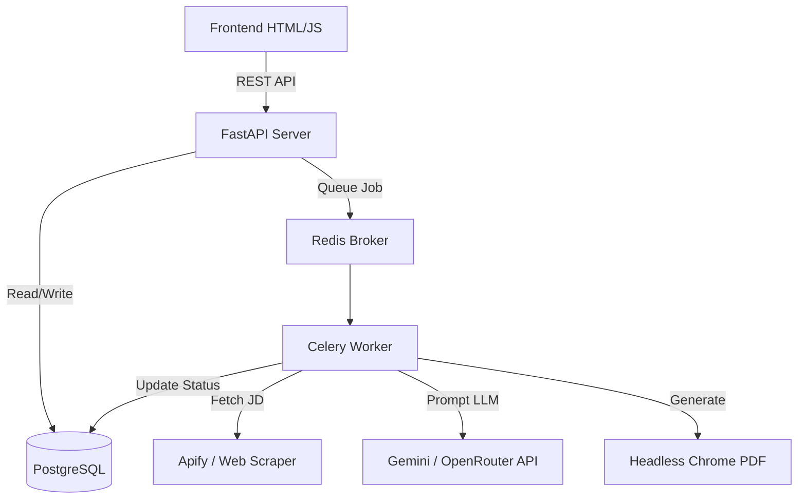

# Pathlight.ai — Comprehensive Project Overview

> [!NOTE]
> This document serves as a 10-page comprehensive technical and architectural overview of the **Pathlight.ai** system. It details the entire stack, from the frontend interface down to the asynchronous task workers and language model integrations.

---

## Page 1: Executive Summary & Project Goals

### 1.1 The Vision
**Pathlight.ai** is an autonomous AI agent designed to revolutionize the job application process. By taking a master resume and a list of target roles (or actively scraping them), Pathlight automatically tailors resumes to perfectly match specific job descriptions, injects required ATS (Applicant Tracking System) keywords, and generates production-ready PDFs.

### 1.2 The Problem
The traditional job search is broken. Candidates spend up to 90% of their time manually formatting resumes and filling out redundant forms. This manual tailoring is essential to bypass modern ATS filters but is highly unscalable for the candidate.

### 1.3 The Pathlight Solution
Pathlight turns the job search into an automated pipeline:
1. **Connect & Forget**: Users provide a master resume.
2. **Autonomous Tailoring**: The LLM engine evaluates job descriptions, scores candidate suitability, and restructures the resume to highlight matching experiences.
3. **Automated Output**: A beautifully formatted PDF is generated for each matched role, alongside personalized cover letters and tracking data.

---

## Page 2: System Architecture & Tech Stack

The system is built as a modernized, containerized application with decoupled frontend, backend, and background processing layers.

### 2.1 Core Technologies
- **Frontend**: Vanilla HTML5, CSS3, JavaScript (ES6+). No heavy frameworks, ensuring ultra-fast load times, SEO compatibility, and ease of modification.
- **Backend**: Python 3.11 with **FastAPI**. Chosen for its high performance, native async support, and auto-generated OpenAPI documentation.
- **Task Queue**: **Celery** with **Redis** as the message broker. Used to handle long-running LLM generation tasks without blocking the API.
- **Database**: **PostgreSQL** with **SQLAlchemy** ORM for robust, relational data storage.
- **LLM Engine**: **Google Gemini (1.5 Flash Latest)** as the primary intelligence, with **OpenRouter (Llama 3)** fallback.
- **PDF Generation**: headless Chrome via **Pyppeteer/Puppeteer**, converting HTML templates to perfect PDFs.
- **Infrastructure**: **Docker** & **Docker Compose** for local orchestration and reproducible environments.

### 2.2 Architectural Diagram

---

## Page 3: Database Schema & Entity Relationships

The data layer is managed via SQLAlchemy and strictly enforces foreign-key relationships to track jobs, candidates, and generated artifacts.

### 3.1 Core Tables

1. **`tailoring_jobs`**: The root entity for a bulk execution.
   - Tracks `status`, `target_role`, `location`, `selected_model`.
   - Maintains counters: `scanned_jobs`, `matched_jobs`, `generated_resumes`.
   
2. **`scraped_jobs`**: Represents raw data pulled from LinkedIn/Indeed via Apify.
   - Stores `url`, `raw_html`, `normalized_json`.
   - Linked to `tailoring_jobs`.

3. **`applications`**: The final output entity for a tailored job.
   - Stores `job_title`, `company`, `ats_score`, `fit_score`.
   - Contains injected & missing ATS keywords.
   - Points to the localized `generated_resume_path`.

4. **`jd_intelligence_cache`** & **`evidence_maps`**: 
   - Optimize LLM costs by hashing job descriptions and candidate resumes, ensuring that identical combinations are instantly retrieved rather than regenerated.

---

## Page 4: Backend API & FastAPI Core

The backend acts as the orchestrator, serving static files and exposing REST endpoints for the frontend.

### 4.1 Key Endpoints
- `POST /api/tailor`: Initiates a single resume tailoring job.
- `POST /api/bulk-tailor`: Initiates a multi-job scraping and tailoring run via Celery.
- `GET /api/jobs/{job_id}`: Polls for real-time status updates on a tailoring batch.
- `GET /api/jobs/{job_id}/applications`: Retrieves the customized resumes for a completed job.

### 4.2 Middleware & Serving
- **Static Mounting**: The frontend `public` directory is mounted directly, serving HTML/CSS/JS cleanly.
- **CORS**: Configured to allow seamless interactions during development.
- **Dynamic Routing Bypasses**: Specific routes like `/css/{file}` ensure that static assets don't get trapped by catch-all frontend routers.

---

## Page 5: Celery Asynchronous Job Pipeline

Because LLM generation and headless PDF rendering take 15–30 seconds per resume, these processes cannot run on the main FastAPI event loop.

### 5.1 The 14-Step Pipeline
The `process_resume_task` in `backend/celery_app.py` executes a deterministic pipeline:
1. **Extraction**: Parse candidate's master resume (PDF/DOCX).
2. **JD Normalization**: Standardize the scraped job description.
3. **Suitability Filter**: Run a fast LLM pass to ensure the candidate actually qualifies for the role (e.g., checking Years of Experience).
4. **Intelligence Mapping**: Map candidate skills directly to JD requirements.
5. **Tailoring**: The heavy LLM pass—rewriting bullet points without hallucinating experiences.
6. **HTML Rendering**: Injecting the LLM output into a beautiful Jinja2 HTML template.
7. **PDF Generation**: Converting HTML to PDF.
8. **Finalizing**: Saving to PostgreSQL and marking the status as complete.

### 5.2 Resilience
Celery workers are configured with automatic retries, ensuring that transient LLM API timeouts or rate limits do not crash the user's bulk processing run.

---

## Page 6: AI Integration (Gemini/OpenRouter)

The "Brain" of Pathlight is encapsulated in `backend/services/llm/mcp.py`.

### 6.1 Multi-Model Routing
The system allows the user to choose their preferred model via the frontend UI.
- Primary: `gemini-1.5-flash-latest` (Extremely fast, cheap, high context window).
- Fallback: `meta-llama/llama-3.3-70b-instruct` via OpenRouter (Used automatically if Gemini is rate-limited or throws a 404/500).

### 6.2 Prompt Engineering
The system utilizes highly structured prompts to guarantee JSON responses:
> *"You are an expert technical recruiter... Evaluate if this candidate is a realistic match for this role... Return ONLY a JSON object with a confidence_score and reason."*

By strictly enforcing JSON schemas, the backend easily parses the LLM output directly into database objects.

---

## Page 7: Resume Generation & PDF Rendering Workflow

Generating a perfect PDF that is visually stunning yet ATS-readable is a major technical challenge.

### 7.1 HTML Templates
We use Jinja2 to render `modern_template.html`. This template uses semantic HTML (headers, lists, sections) which ATS parsers love, wrapped in CSS that human recruiters find aesthetically pleasing.

### 7.2 Headless Chrome (Pyppeteer)
The `pdf_generator.py` service spawns a headless Chromium instance:
- It loads the injected HTML.
- Waits for network idle (ensuring web fonts like Inter/Outfit load).
- Prints to PDF with specific margins and no background graphics (to ensure clean text extraction).

---

## Page 8: Frontend Architecture & UI Features

The frontend is a bespoke, premium interface designed to rival top-tier SaaS products (like Vercel, Linear, or Stripe).

### 8.1 Cyber-Themed Design System
- **CSS Variables**: `style.css` defines a strict token system (e.g., `--bg-base: #000000`, `--accent-primary: #8a2be2`).
- **Glassmorphism**: Panels use deep transparency and backdrop blurs to create depth.
- **Micro-interactions**: Hover states, glowing borders, and smooth transitions make the UI feel alive.

### 8.2 Live Visualizers
The dashboard features dynamic visualizers that simulate backend processes:
- **Resume Tailoring Visualizer**: A pulsing ring showing real-time ATS match scores.
- **Status Spinners**: Providing the user with immediate visual feedback while Celery works in the background.

---

## Page 9: Deployment, Docker & DevOps

Pathlight is built for immediate local execution and easy cloud deployment.

### 9.1 Docker Compose
The `docker-compose.yml` spins up four distinct containers:
1. `postgres`: The database layer.
2. `redis`: The message broker.
3. `api`: The FastAPI web server.
4. `celery_worker`: The background processor.

Volumes are configured to persist database states and generated PDFs locally on the host machine.

### 9.2 Error Handling & Logging
- **Centralized Logging**: Both FastAPI and Celery stream formatted logs for easy debugging.
- **Graceful Failures**: If the LLM fails, the pipeline logs the specific error, marks the individual application as "Failed", and continues processing the rest of the bulk queue.

---

## Page 10: Future Roadmap & Scaling Strategy

While Pathlight is fully functional, the architecture is designed to scale into a massive B2C platform.

### 10.1 Planned Enhancements
- **Automated Applying**: Expanding the pipeline from just "Tailoring Resumes" to actively filling out Greenhouse/Lever forms via browser automation (Playwright).
- **Email Generation**: Drafting hyper-personalized cold outreach emails to hiring managers alongside the resume.
- **Kubernetes Scaling**: Moving from Docker Compose to K8s to dynamically scale Celery workers based on queue length (using KEDA).
- **User Authentication**: Implementing JWT-based auth and Stripe billing to monetize the platform.
- **RAG (Retrieval-Augmented Generation)**: Allowing the LLM to search the candidate's GitHub repositories or past projects to hallucination-proof the generated resume bullet points.

---
*Generated by Antigravity AI — Architecture & Systems Audit*
